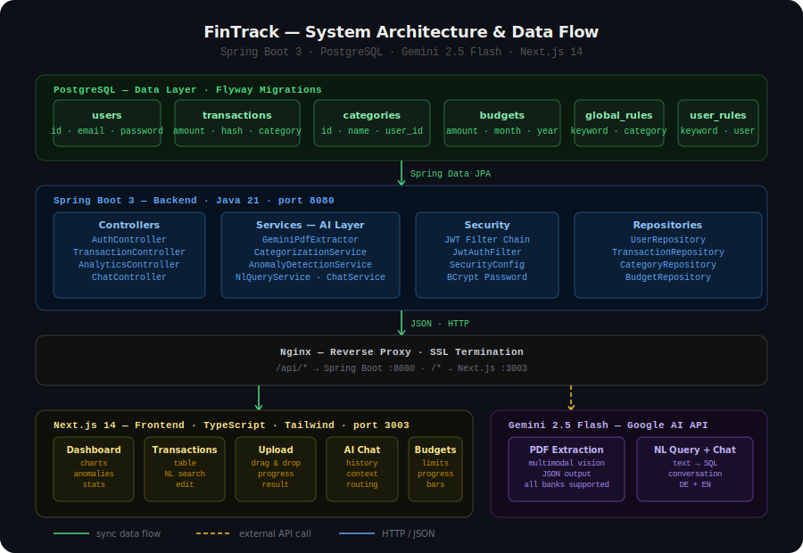

<div align="center">

# 🟢 FinTrack

### AI-Powered Personal Finance Tracker

*Upload your bank statement. Get instant AI insights.*

[](https://spring.io/projects/spring-boot)
[](https://nextjs.org)
[](https://www.typescriptlang.org)
[](https://www.postgresql.org)
[](https://ai.google.dev)
[](https://www.docker.com)

**[🚀 Live Demo](https://fintrack.omidtavassoli.dev)**<br>


</div>

---

## What it does

German banks give you raw transaction lists with no intelligence. FinTrack takes your monthly PDF bank statement and turns it into actionable insights — automatically categorized, anomaly-detected, and queryable in plain language.

No bank connection required. No subscription. Your data stays on your server.

---

## Demo

** go to [fintrack.omidtavassoli.dev](https://fintrack.omidtavassoli.dev) to see the demo or make an account to use the application ** 

---

## Features

| Feature | Description |
|---------|-------------|
| **PDF Extraction** | Gemini Vision reads any German bank PDF and returns structured transaction data |
| **AI Categorization** | Rule cache handles known merchants instantly. Gemini covers the rest with 98%+ accuracy |
| **Anomaly Detection** | Z-score analysis automatically flags unusual spending |
| **NL Query Engine** | Ask "How much did I spend on food in October?" — get a precise answer |
| **AI Chat Assistant** | Conversational finance advisor with full access to your transaction history |
| **Budget Tracking** | Set monthly limits per category, track progress visually |
| **Analytics Dashboard** | Monthly charts, category breakdown, anomaly alerts |

---

## How the AI pipeline works

PDF Upload
→ Gemini Vision extracts transactions as structured JSON
→ TextNormalizer cleans raw bank descriptions
→ Rule cache checked first (learns from your corrections)
→ Gemini Flash called only for unknown merchants
→ Z-score anomaly detection runs on categorized data
→ NL query engine translates plain language → SQL → answer

The system learns from corrections — every category override becomes a rule that skips Gemini on future uploads.

---

## Tech Stack

| Layer | Technology |
|-------|------------|
| Backend | Spring Boot 3, Java 21 |
| Database | PostgreSQL + Flyway |
| AI | Google Gemini 2.5 Flash (multimodal) |
| Frontend | Next.js 14, TypeScript, Tailwind |
| Charts | Recharts |
| Auth | JWT |
| Infrastructure | Docker, Nginx, Hetzner VPS |

---

## Architecture

<div align="center">
  
</div>

---

## Project Structure

```
fintrack/
│
├── backend/                          # Spring Boot 3 · Java 21
│   └── src/main/
│       ├── java/com/fintrack/fintrack/
│       │   ├── controller/           # REST endpoints
│       │   │   ├── AuthController
│       │   │   ├── TransactionController
│       │   │   ├── AnalyticsController
│       │   │   ├── ChatController
│       │   │   ├── BudgetController
│       │   │   ├── NlQueryController
│       │   │   └── HealthController
│       │   ├── service/              # Business logic + AI
│       │   │   ├── GeminiClient          ← Gemini API wrapper
│       │   │   ├── GeminiPdfExtractor    ← PDF → structured JSON
│       │   │   ├── CategorizationService ← rules → Gemini fallback
│       │   │   ├── PdfIngestionService   ← upload orchestration
│       │   │   ├── AnomalyDetectionService ← z-score detection
│       │   │   ├── NlQueryService        ← text → SQL → answer
│       │   │   ├── ChatService           ← conversational AI
│       │   │   ├── AnalyticsService      ← spending analytics
│       │   │   └── TextNormalizer        ← description cleaning
│       │   ├── repository/           # Spring Data JPA interfaces
│       │   ├── entity/               # JPA entities (DB tables)
│       │   ├── dto/                  # Request/response objects
│       │   ├── security/             # JWT filter chain
│       │   └── exception/            # Global error handling
│       └── resources/
│           ├── db/migration/         # Flyway SQL migrations (V1–V6)
│           └── application.yaml      # App configuration
│
└── frontend/                         # Next.js 14 · TypeScript · Tailwind
└── src/app/
├── (auth)/
│   └── login/                # Login + register + demo button
└── (app)/
├── dashboard/            # Charts · anomalies · stats
├── transactions/         # Table · NL search · category edit
├── upload/               # PDF upload · ingestion result
├── chat/                 # AI chat assistant
└── budgets/              # Budget tracking · progress bars
```
**Database Migrations** `Flyway`<br>
V1 — users<br>
V2 — categories<br>
V3 — transactions<br>
V4 — budgets<br>
V5 — global_category_rules<br>
V6 — user_category_rules<br>

---

** Built by Omid Tavassoli [portfolio.omidtavassoli.dev](https://portfolio.omidtavassoli.dev) **