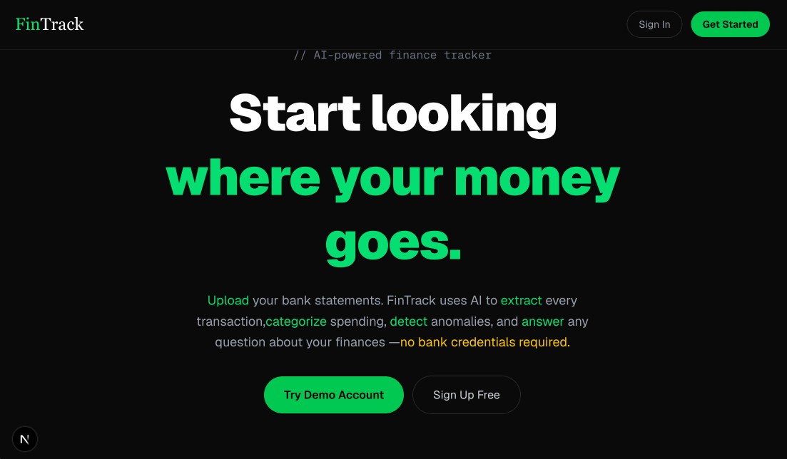

# FinTrack — AI-Powered Personal Finance Tracker



> Upload your bank statement. Get instant AI insights.

**[Live Demo](https://fintrack.omidtavassoli.dev)** 

---

## What it does

German banks give you raw transaction lists with no intelligence. FinTrack takes your monthly PDF bank statement and turns it into actionable insights — automatically categorized, anomaly-detected, and queryable in plain language.

No bank connection required. No subscription. Your data stays on your server.

---

## Demo

**[fintrack.omidtavassoli.dev](https://fintrack.omidtavassoli.dev)** 

---

## Features

| Feature | Description |
|---------|-------------|
| **PDF Extraction** | Gemini Vision reads any German bank PDF and returns structured transaction data |
| **AI Categorization** | Rule cache handles known merchants instantly. Gemini covers the rest with 98%+ accuracy |
| **Anomaly Detection** | Z-score analysis automatically flags unusual spending |
| **NL Query Engine** | Ask "How much did I spend on food in October?" — get a precise answer |
| **AI Chat Assistant** | Conversational finance advisor with full access to your transaction history |
| **Budget Tracking** | Set monthly limits per category, track progress visually |
| **Analytics Dashboard** | Monthly charts, category breakdown, anomaly alerts |

---

## How the AI pipeline works

PDF Upload
→ Gemini Vision extracts transactions as structured JSON
→ TextNormalizer cleans raw bank descriptions
→ Rule cache checked first (learns from your corrections)
→ Gemini Flash called only for unknown merchants
→ Z-score anomaly detection runs on categorized data
→ NL query engine translates plain language → SQL → answer

The system learns from corrections — every category override becomes a rule that skips Gemini on future uploads.

---

## Tech Stack

| Layer | Technology |
|-------|------------|
| Backend | Spring Boot 3, Java 21 |
| Database | PostgreSQL + Flyway |
| AI | Google Gemini 2.5 Flash (multimodal) |
| Frontend | Next.js 14, TypeScript, Tailwind |
| Charts | Recharts |
| Auth | JWT |
| Infrastructure | Docker, Nginx, Hetzner VPS |

---

## Architecture

┌──────────────┐         ┌─────────────────────────────┐
│  Next.js 14  │─HTTPS──▶│   Nginx (Reverse Proxy)     │
└──────────────┘         └──────────────┬──────────────┘
│
┌──────────────▼──────────────┐
│       Spring Boot 3          │
│  Controller → Service → JPA  │
└──────┬──────────────┬────────┘
│              │
┌───────────▼───┐  ┌───────▼────────┐
│  PostgreSQL   │  │ Gemini 2.5 Flash│
│  + Flyway     │  │   (Vision + NL) │
└───────────────┘  └────────────────┘

---

## Running Locally

**Prerequisites:** Java 21, Docker, Node.js 18+

```bash
# Clone
git clone https://github.com/omid-tavassoli/fintrack.git
cd fintrack

# Backend
cd backend
docker-compose up -d
# Add environment variables to IntelliJ run configuration:
# DB_USERNAME, DB_PASSWORD, JWT_SECRET, GEMINI_API_KEY
./gradlew bootRun

# Frontend  
cd ../frontend
npm install
echo "NEXT_PUBLIC_API_URL=http://localhost:8080" > .env.local
npm run dev
```

---

## Project Structure

fintrack/
├── backend/                    # Spring Boot
│   └── src/main/java/com/fintrack/fintrack/
│       ├── controller/         # REST endpoints
│       ├── service/            # Business logic + AI
│       ├── repository/         # Spring Data JPA
│       ├── entity/             # JPA entities
│       ├── dto/                # Request/response DTOs
│       ├── security/           # JWT filter chain
│       └── exception/          # Global error handling
└── frontend/                   # Next.js 14
└── src/app/
├── (auth)/             # Login / register
└── (app)/              # Dashboard, transactions, chat

---

*Built by [Omid Tavassoli](https://portfolio.omidtavassoli.dev)